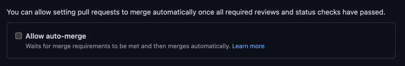

## Pull Request Batching (dependency updates)

There are a number of tools that automate part of the process of keeping your dependencies from various ecosystems up to date. 
Naturally they all have different features, but one that is currently missing from both Dependabot and Scala Steward
(which are both popular) is the ability to combine multiple updates into a single PR.

*Combining PRs in this way may not be the right choice for every project*. If you wish to have granular updates, each running
their own CI, you may wish to keep the default behaviour. At the other end of the risk and automation spectrum, you may
be confident enough to automatically merge PRs straight to main without further review. The workflows here are 
intended for the middle ground where it is desirable for a team member to periodically review a batch of dependency updates
and review/test/merge as appropriate. This saves time vs. the default of Dependabot/Scala Steward, and is lower risk than full automation.

### Workflow

The workflow(s) to enable this automation borrows heavily from this [blogpost](https://alejandrohdezma.com/blog/updating-multiple-repositories-with-scala-steward-and-github-actions).
To summarise:
1. A [workflow](../pr-batching_tracking-branch.yml) is set up to create and update a branch that tracks your default branch 
2. Your dependency update tool (e.g. Scala Steward) sends regular PRs to your repo, **targeting the branch from 1.**
3. Another [workflow](../pr-batching_set-automerge.yml) is set up to automerge these PRs
4. Finally this [workflow](../pr-batching_pr-tracking-branch-to-default.yml) creates a PR on a configurable schedule from the tracking branch. This PR is for manual review by the team

### How to enable
**(N.B. there is a script `scripts/pr-batching.sh` to help automate the creation of these workflows. It is designed to work with [nori](https://github.com/Financial-Times/nori) or similar tools to work with multiple repositories at once.)**
1. Create a workflow in your repository that uses the `tracking-branch` workflow to maintain a dependency update branch:
```yaml
on:
  push:
    branches:
      - main

jobs:
  update-dependency-update-branch:
    name: Keep tracking branch up to date with main
    uses: guardian/.github/.github/workflows/pr-batching_tracking-branch.yml@v1
```
2. Set up your dependency update tooling (e.g. [Scala Steward](https://github.com/guardian/scala-steward-public-repos)) to target this branch. By default it's called `dependency-updates`
3. (Optional) Disable your CI from running builds on branches created by your dependency update tool. This saves time and resources, but makes it less obvious which update caused a failure if there is one. *N.B. If you decide to enable CI, the reusable workflow for updating doesn't currently support making it a required status check because it directly rebases the tracking branch (improvements welcome!)*
4. Set up branch protection on the tracking branch (no specific settings are required) and enable auto-merge on your repository (under General settings):

5. Create a workflow in your repository that uses the `set-automerge` workflow to merge dependency update PRs to the tracking branch when all checks have completed
```yaml
on:
  pull_request:
    branches:
      - dependency-updates

jobs:
  set-automerge:
    name: Set automerge on opened PRs targeting the tracking branch
    permissions:
      contents: write
    uses: guardian/.github/.github/workflows/pr-batching_set-automerge.yml@v1.0.2
```
6. Finally, create a workflow in your repository that uses the `pr-tracking-branch-to-default` workflow to periodically create a batch-update PR targeting your default branch:
```yaml
on:
  schedule:
    - cron: "35 10 * * MON"
  # Provide support for manually triggering the workflow via GitHub.
  workflow_dispatch:

jobs:
  pr-tracking-branch:
    name: Open a PR from dependency-updates targeting main
    uses: guardian/.github/.github/workflows/pr-batching_pr-tracking-branch-to-default.yml@v1.0.2
```

### Improvements
1. Find an alternative to rebasing the dependency branch onto default, that allows (optional) required checks on the dependency branch (for CI.) Perhaps delete and recreate?
2. Find a way to automatically trigger the actions for the PRs we create targeting default branch. At the moment these are not triggered because actions[bot] is used and they don't trigger workflow runs from that bot to avoid circular workflows.
